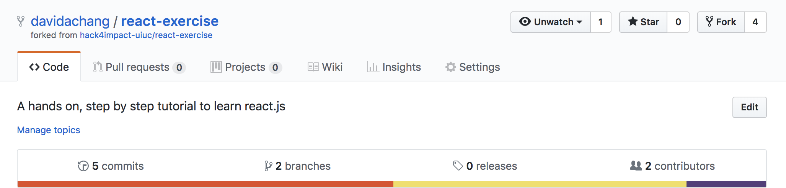

# React.js Exercise


This exercise is intended for you to get familiar with fundamental [React](https://reactjs.org/) concepts in an interactive way, as well as for you to get comfortable developing in a modern [Node.js](https://nodejs.org/en/) environment. This project will be broken down into multiple parts. Each part will cover a fundamental React/frontend concept.

[The React Beginner's Guide](https://flaviocopes.com/react-beginners-guide/) and [The Beginner's Guide to React](https://egghead.io/courses/the-beginner-s-guide-to-reactjs) will be very beneficial to go through to get a complete understanding on React fundamentals. It will also beneficial to get comfortable diving into [React Docs](https://reactjs.org/docs/hello-world.html) and [Javascript Docs](https://developer.mozilla.org/en-US/docs/Web/JavaScript/Reference) as part of this exercise.

### Requirements
* node version 8.x
* npm version 5.x

Install node and npm [here](https://nodejs.org/en/download/).

Check if you have the correct versions by running the following commands in your terminal:
```
node -v
```
```
npm -v
```

### Setup

Install the [React Devtools](https://github.com/facebook/react-devtools) to easily debug and see what's going on in your React app.

Your text editor may not natively support the JSX syntax that is used in this project, but there may be plugins to get proper syntax highlighting. For example, Sublime Text uses the `Babel` plugin.

First, fork this repository. The fork button on your top right. What this does is copies this repository over to your account. Now you should have a repository with the name `<yourusername>/flask-exercise`.

It should look like this (my username is davidachang):


Then, clone this repository (click the green button saying "Clone or Download", choose http, and copy and paste it the location `<url>` ) and go into it:

```
$ git clone <url>
$ cd react-exercise
```

Install project dependencies:
```
npm install
```

After that's done, run this to start development:
```
npm start
```

This will start running the app and automatically open it at [http://localhost:3000](http://localhost:3000). Anytime you change and save the code, it will automatically reload! This will remain a running process in your terminal, so you will need to open a new tab or window to execute other commands.

### Optional Setup
Prettier is a tool that automatically reformats your code to follow a certain set of coding style guidelines. It is configured to run automatically before each commit. This makes sure all of our code follows the same code styles, enforcing good practices and minimizing conflicts.

It is definitely not necessary for this exercise, but there are prettier plugins you can install for your editor. See instructions [here](https://github.com/prettier/prettier#editor-integration).

## Part 1
Goal: Get familiar with JSX syntax, component structure, and passing props

Tasks:
* Send a `shouldDisplayImage` prop into the `Instructions` component that determines whether or not to display the H4I logo [Hint](https://reactjs.org/docs/conditional-rendering.html)

## Part 2
Goal: Get familiar with rendering lists and javascript array functions

Tasks:
* Send an `items` prop into the `Instructions` component which contains a list of strings
* Display a bullet point list of all the `items`
* Remove all items that are less than 3 characters long
* Make _every other_ list item uppercase
* Do this without using `for` or `while` loops
* Very useful videos to watch:
 * [Functional Programming Intro](https://www.youtube.com/watch?v=BMUiFMZr7vk&index=1&list=PL0zVEGEvSaeEd9hlmCXrk5yUyqUag-n84) - just the first two videos are enough, although there's a lot to learn from the rest of the playlist and his other videos! (highly recommend subscribing)
 * [Rendering lists in React](https://egghead.io/lessons/egghead-use-the-key-prop-when-rendering-a-list-with-react)

## Part 3
Goal: Get familiar with component state

Tasks:
* Create a new `Counter` component
* Set its initial state of `count` to `0`
* Display the value of the current count
* Create two buttons, one that increments the count and one that decrements it. [Hint](https://egghead.io/lessons/react-use-component-state-with-react)

## Part 4
Goal: Get familiar with user input

Tasks:
* In `App.js`, make an input and a submit button that sets an `initialCount` state
* Validate the user input to make sure it's valid (is a number)
* Pass the `initialCount` state as a prop into the `Counter` component, and use this value as the initial `count` in the `Counter`. Make sure to watch out for types when doing this, since user input is a `String` and we want to send in a `Number`.
* Bonus: show UI feedback if user input is invalid (a simple message will do)
* Note: If your button refreshes the page, throw in a button type: `<button type="button" ...`

## Part 5
Goal: Understand state/props communication between sibling components

Tasks:
* Move the `input` and submit button into its own component called `InitialCountForm` that is a child of the `App` component
* Maintain that the functionality of being able to set the initial count of the counter works
* Potentially useful: [React Component Lifecycle](https://reactjs.org/docs/react-component.html), specifically [componentWillReceiveProps](https://reactjs.org/docs/react-component.html#componentwillreceiveprops). Tangentially relevant: [React Cheat Sheet](https://reactcheatsheet.com/)
* Useful: [Moving State Up In The Tree](https://flaviocopes.com/react-beginners-guide/#moving-the-state-up-in-the-tree)

## Part 6
Goal: Get familiar with CSS/SCSS and styling

Tasks: Nothing specific, play around with styling!

Note: You can create SCSS files, and they will be automatically compiled to CSS files when you save, but you need to import the CSS file into your component.

Some styling related resources:
* [Learn Layout](http://learnlayout.com/)
* [A Complete Guide To Flexbox](https://css-tricks.com/snippets/css/a-guide-to-flexbox/)
* [BEM Pattern](https://css-tricks.com/bem-101/)

### Resources
[The React Beginner's Guide](https://flaviocopes.com/react-beginners-guide/)<br>
[MDN - A reintroduction to Javascript](https://developer.mozilla.org/en-US/docs/Web/JavaScript/A_re-introduction_to_JavaScript)<br>
[The Beginner's Guide to React](https://egghead.io/courses/the-beginner-s-guide-to-reactjs)<br>
[React Docs](https://reactjs.org/docs/hello-world.html)<br>
[Airbnb's Javascript Style Guide](https://github.com/airbnb/javascript)<br>
[Airbnb's React Style Guide](https://github.com/airbnb/javascript/tree/master/react)<br>
[Airbnb's CSS Style Guide](https://github.com/airbnb/css)

## Submitting

When you're done with all the steps, push your changes to your github repo!

Before you can submit a PR, you'll have to push your branch to a remote branch (the one that's on GitHub, not local).

Check to see that you're on your branch:

```
git branch
```

If you want to make sure all of your commits are in:

```
git log
```

Press `Q` to quit the `git log` screen.

Push your commits to your remote branch:

```
git push
```

The first time you do this, you might get an error since your remote branch doesn't exist yet. Usually it will tell you the correct command to use:

```
git push --set-upstream origin <YOUR_BRANCH_NAME>
```

Note: this only needs to be done the first time you push a new branch. You can use just `git push` afterwards.

Once this is done, please send an email to tko@hack4impact.org with the link to your _forked_ repository and your branch name. We will need these two things to view your submission.


```
H A C K 4 I M P A C T
                    H A C K 4 I M P A C T
                                        H A C K 4 I M P A C T
                                                            H A C K 4 I M P A C T
                                                                                H A C K 4 I M P A C T
```

